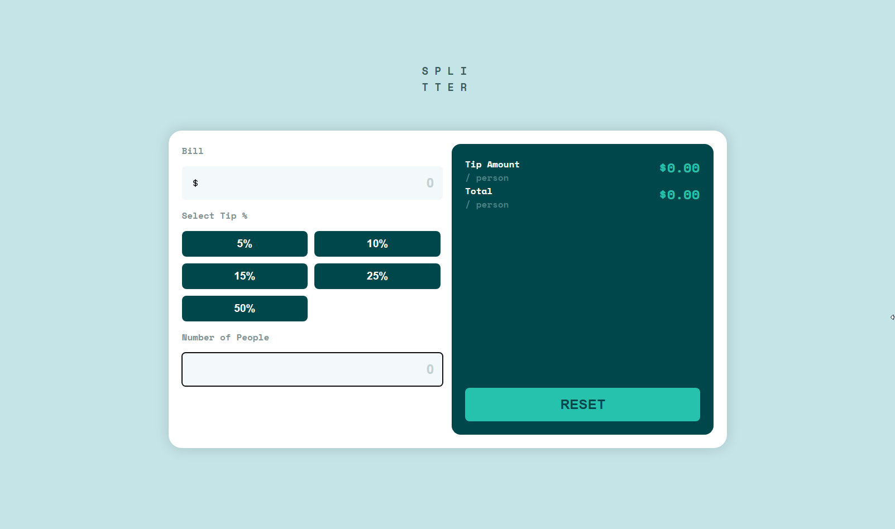

# Tip-Calculator-App

## Description

The Tip-Calculator-App is a simple tool that helps you calculate the appropriate tip amount and total bill per person when dining out or receiving a service. 

The app is responsive so both optimize for desktop or mobile devices.

## Features

- **Bill Amount**: Enter the total bill amount in the designated input field.
- **Select Tip %**: Choose the desired tip percentage from the provided options (5%, 10%, 15%, 25%, 50%).
- **Number of People**: Specify the number of people splitting the bill.
- **Tip Amount**: Displays the calculated tip amount per person.
- **Total Amount**: Shows the total bill amount per person, including the tip.

## Technology

  
 
  
  

## Demo

To see a live demo of the Tip-Calculator-App, visit [Demo](https://www.massidev.com/portfolio/drumpad/).

## Installation

To run the Tip-Calculator-App locally, follow these steps:

1. Clone the repository: `git clone https://github.com/massi-17/tip-calculator-app.git`
2. Navigate to the project directory: `cd tip-calculator-app`
3. Open the `index.html` file in your preferred web browser.

## Contributing

Contributions are welcome! If you want to contribute to this Tip-Calculator-App, please follow these steps:

1. Fork the repository.
2. Create a new branch: `git checkout -b feature/your-feature`.
3. Make your changes and commit them: `git commit -m 'Add your feature'`.
4. Push to the branch: `git push origin feature/your-feature`.
5. Submit a pull request.

